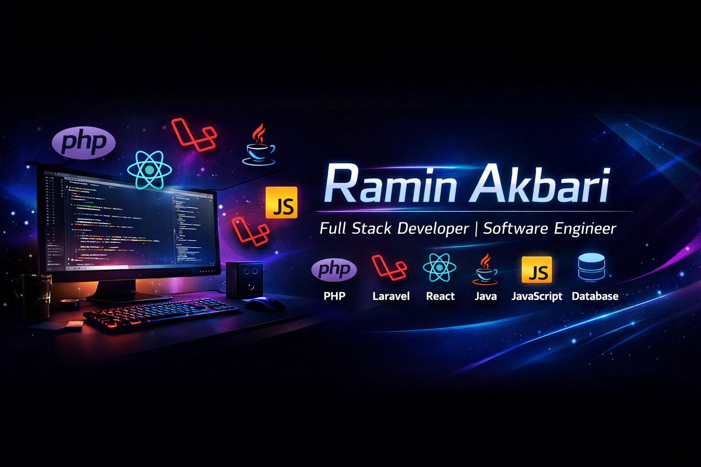

  

Hi, I'm **Ramin Akbari**, a **Full Stack Developer & Software Engineer**.  
I build modern and efficient web applications using **PHP, Laravel, React, Java, JavaScript, and Databases**.  

I enjoy solving challenging problems, learning new technologies, and contributing to open-source projects.

## 🌐 Socials:
  

# 💻 Tech Stack:
                  
# 📊 GitHub Stats:
 
 

<!-- Proudly created with GPRM ( https://gprm.itsvg.in ) -->
